# YSDA 2023 Image to Image DDPM project

## Disclaimer

While the code in ```notebooks``` is referred to as ours in this repo, we do not claim ownership of it in its entirety, as it is mostly repurposed code from associated repositories, edited for ease of use and adapted for our required datasets for this project.

## Presentation
Presentation for the project can be found [here](https://github.com/nikitamann/YSDA_2023_Image_to_Image_DDPM_project/blob/main/Presentation%20Image-to-Image%20style%20transfer%20problem%20with%20DDPM.pdf).

## DDIB
Associated repositories: [Dual Diffusion Implicit Bridges](https://github.com/suxuann/ddib?ysclid=lqnvfvwd85512766560), [improved-diffusion](https://github.com/openai/improved-diffusion/tree/main).

Our code is located [here](https://github.com/nikitamann/YSDA_2023_Image_to_Image_DDPM_project/blob/main/notebooks/DDIB_colored_MNIST_example.ipynb).
- ```notebooks/DDIB_colored_MNIST_example.ipynb``` - Our code for running DDIB on Color-MNIST.

*Some results:*
<p float="left">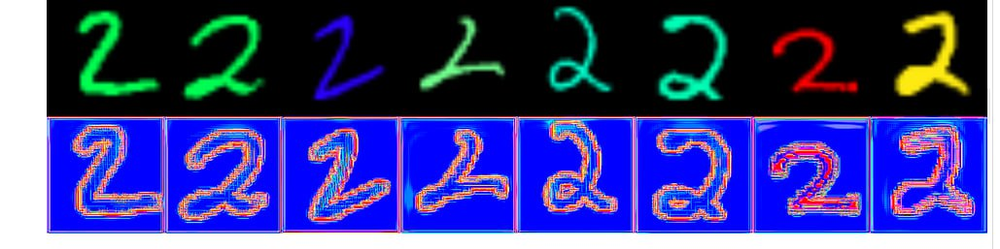</p>

## UNIT-DDPM
Associated repository: [UNIT-DDPM-Unofficial](https://github.com/konkuad/UNIT-DDPM-Unofficial/tree/main)

- ```notebooks/unit_ddpm.ipynb``` - Our code for running UNIT-DDPM on [colorized-MNIST](https://github.com/jayaneetha/colorized-MNIST).

*Some results:*

<p float="left">
  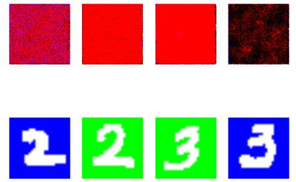
</p>

## CycleGAN
Associated repository: [Unpaired Image-to-Image Translation using Cycle-Consistent Adversarial Networks](https://junyanz.github.io/CycleGAN/)

- ```notebooks/CycleGAN.ipynb``` - Our code for running CycleGAN on [Gender Classification 200K Images | CelebA](https://www.kaggle.com/datasets/ashishjangra27/gender-recognition-200k-images-celeba?resource=download-directory).

*Some results:*

<p float="left">
  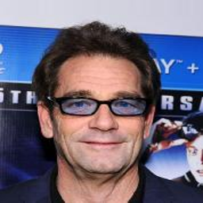
  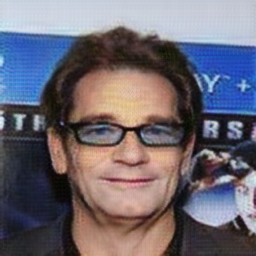 
  
</p>
<p float="left">
  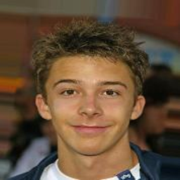
  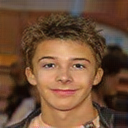 
  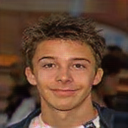
</p>
<p float="left">
  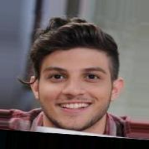
  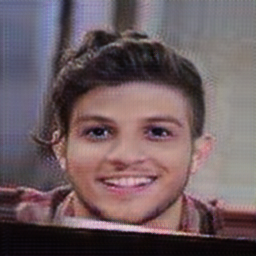 
  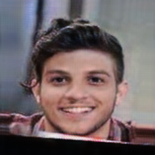
</p>
<p float="left">
  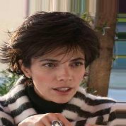
  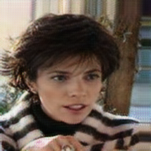 
  
</p>

*And here are some results that were achieved on this model by other people:*
<p float="left">
  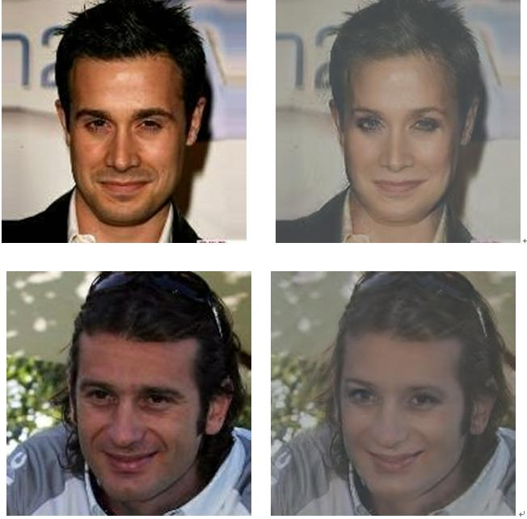
  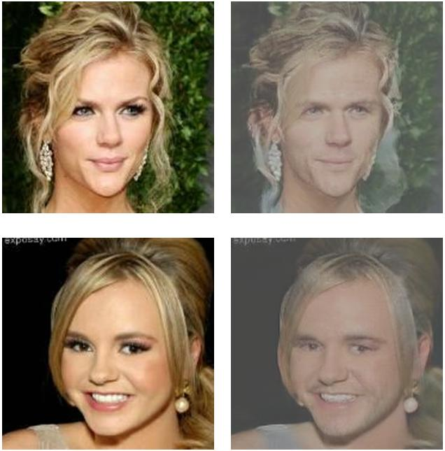 
</p>

## NOT

Associated repository: [Neural Optimal Transport](https://github.com/iamalexkorotin/NeuralOptimalTransport?ysclid=lqo6gh9ztk743876043)

Regretfully, we were not able to run ```notebooks/NOT_training_strong.ipynb``` from this repository on [img_align_celeba](https://www.kaggle.com/datasets/yunting0123/img-align-celeba) dataset, and as such have no results to show, but nevertheless the code for attempts can be found in ```notebooks/NOT_straining_strong.ipynb```. (Note that all the code that uses Cuda needed to be commented out, because at the time google colab was restricting access to the gpu, and as such any code that used Cuda could not be executed).
